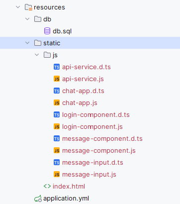
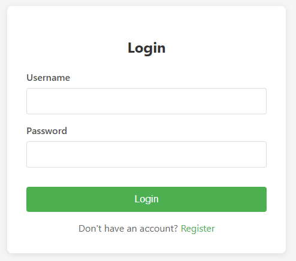

# Java Web + Database Exercise 2: Infinite Level Messaging System

[https://github.com/recruitment-vn/recruitment-java-backend-comments-tree-homework-LeTrungThang](https://github.com/recruitment-vn/recruitment-java-backend-comments-tree-homework-LeTrungThang)

## How to Run Project

This project is built with Spring boot 3, Java 22 and Lit 3 (https://lit.dev) for frontend, Maven build tool, https://aiven.io for PostgreSQL DB.

### Install dependencies (first time only)

`npm install`

### Compile TypeScript from ./src/frontend/ to JavaScript

`npm run build`

### Make sure these output files exist in src/main/resources/static/js/ after build:

### Build maven project

`mvn clean install`

### Run project directly from IDE (IntelliJ IDEA) or `mvn spring-boot:run`

Access home page: `http://localhost:8080`

## Difficulty:

Ordinary.

## Concept:

Create a simple website implementing a feature that is straightforward but slightly challenging; use a database; include registration and login functionality; separate frontend and backend, with Java providing RESTful APIs, popular frameworks can be used; frontend can use any frontend framework.

## Content:

Create a simple "tree-structured message board" website using Java and a database. The challenge lies in handling "infinite nesting," requiring experience in database design, ORM/SQL queries, and page rendering. It should also assess candidates on basic user registration/login functionality, focusing on password handling, field validation, and browser session/cookie management. As frontend-backend separation is common, the Java backend should provide RESTful APIs. The frontend can use any framework (including but not limited to jQuery, React, Vue, Angular, etc.).

## Requirements

- Users can register on the website
  - They need to provide a username, password, and email.
  - Username requirements: must not be empty, can only contain letters and numbers, length between 5-20 characters, and must be unique.
  - Password requirements: must not be empty, length between 8-20 characters, and must include at least one uppercase letter, one lowercase letter, one number, and one special character.
  - Email requirements: must not be empty, must be in a valid format, and must be unique. For simplicity, no email confirmation is needed.

- Users can log in to the website
  - They can log in using username + password or email + password.
  - Provide a "remember me" feature to stay logged in for a month.
  - If "remember me" is not checked, users will need to log in again after closing the browser.
  - After logging in, display the username and email at the top of the page.

- After logging in, users can post messages
  - Message length must be between 3-200 characters and can be in Vietnamese.
  - While typing, provide dynamic feedback on how many characters are left.
  - Record the message posting time.

- Users can comment on a specific message
  - Comment requirements are the same as for messages.
  - Users can reply to a comment, with unlimited nesting.

- Users can view messages
  - A single page displays all messages and nested comments in a tree structure.
  - The backend generates the complete tree structure and provides it to the frontend in one go; the frontend only displays it without making multiple requests or lazy loading.
  - Messages are arranged in reverse chronological order from top to bottom, with the newest at the top.
  - Each message shows the poster's username and posting time.
  - Viewing messages does not require logging in.

## Technical Requirements

- Provide a command to initialize and start the website, ultimately opening the homepage in a browser.
- Any Java framework can be used.
- Use a database (relational or NoSQL), create tables, and use SQL/No-SQL/ORM, etc. For ease of review, it's recommended to use a simple file-based database (e.g., SQLite) that doesn't require installation.
- When users register, passwords must be stored using irreversible encryption.
- You can use ORM or raw SQL for database queries.
- The backend should provide a RESTful API with proper permission checks, HTTP methods, and HTTP codes.
- Ensure no significant performance issues with deeply nested comments (e.g., over several dozen layers).
- Include appropriate unit tests.

## How to submit assignments

1. Due to confidentiality, this repo does not support forks.
2. Clone locally using the git:// protocol (https:// might prevent pushing).
3. Create a new branch locally, complete your work, and push it directly to this repo.
4. Create a PR from the branch, but do not merge the PR.
5. You can leave comments on the PR, such as "Completed," and we'll get notified to schedule a review.
6. Submit only the necessary code and files. Be careful not to submit zip files.

